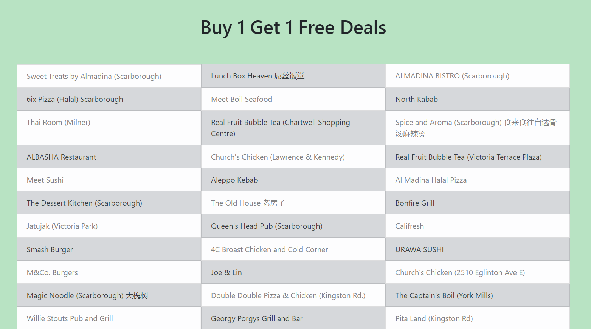

# ubereats-webscrape

## Description
This application is a web scrape of UberEats to find Buy 1 Get 1 Deals. It uses puppeteer as the library to make the webscrape and it is deployed on Heroku. There is also a version for Electron (another branch)

* Link to the app on Heroku: dry-plains-77570.herokuapp.com/
* Link to the Github repository: https://github.com/akwanmtl/ubereats-webscrape

## Table of Contents

* [Usage](#usage)
* [Credits](#credits)
* [License](#license)

## Usage 

The user enter their address. Then after some time (web scraping does take some time), you are presented with the list of restaurants near you with Buy 1 Get 1 Deals

## Credits

* [How To Scrape a Website Using Node.js and Puppeteer](https://www.digitalocean.com/community/tutorials/how-to-scrape-a-website-using-node-js-and-puppeteer)
* [puppeteer-heroku-buildpack](https://github.com/jontewks/puppeteer-heroku-buildpack)
* [Extending the Heroku Timeout in Node.js](https://spin.atomicobject.com/2018/05/15/extending-heroku-timeout-node/)
* [License badge link](https://gist.github.com/lukas-h/2a5d00690736b4c3a7ba)

## License

Copyright (c) [2020] [Annie Kwan]